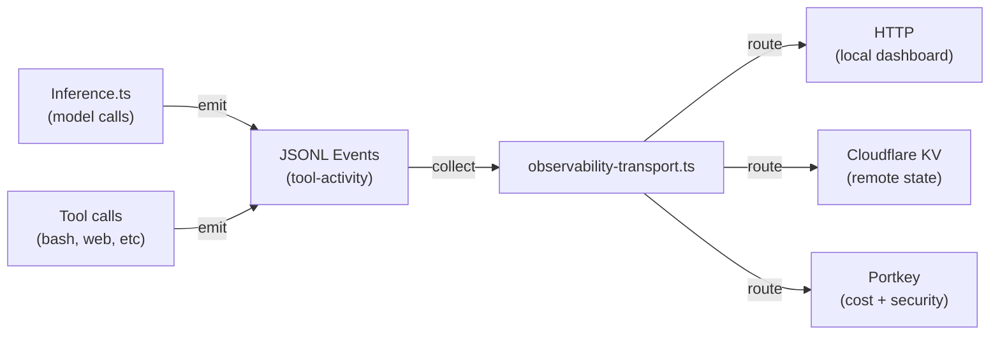

# Integration Documentation

Central registry for PAI third-party integrations and gateway implementations.

---

## Portkey AI LLM Gateway

**Status:** Design phase (ready for implementation)

**Overview:** Centralized logging for all LLM inference calls (Claude, Ollama, DeepSeek). Enables cost attribution, prompt injection detection, and audit trails for agentic systems.

### Quick Start

1. **Want to integrate Portkey?** → Start with `PortkeyIntegration.md` (4-page technical guide)
2. **Need step-by-step checklist?** → `PortkeyImplementationChecklist.md` (30-point, 4-6 hour task list)
3. **Building ASA with Portkey?** → `PortkeyASAIntegration.md` (security evidence mapping)
4. **Understanding ASA workflow impact?** → `PortkeyASAWorkflow.md` (ES client narratives + timeline)

### Files

| File | Purpose | Audience | Read Time |
|------|---------|----------|-----------|
| `PortkeyIntegration.md` | Technical architecture + implementation guide | Engineers | 10 min |
| `PortkeyImplementationChecklist.md` | Step-by-step task list with verification | Engineers | 15 min (scan); 4-6 hours (work) |
| `PortkeyASAIntegration.md` | ASA finding categories + evidence extraction | Security team | 12 min |
| `PortkeyASAWorkflow.md` | Workflow + client narratives + timeline | PM, Sales, Delivery | 15 min |

### Integration Points

```
Observability Transport Layer (hooks/lib/observability-transport.ts)
    ↓
Add Portkey target type (hooks/lib/identity.ts)
    ↓
Configure in settings.json
    ↓
Emit from Inference.ts
    ↓
Route to Portkey API
    ↓
Portkey Dashboard
```

### Architecture at a Glance



---

## Implementation Stages

### Stage 0: Foundation (Done)
- [x] Research Portkey architecture
- [x] Design integration with PAI observability
- [x] Map to ASA use cases
- [x] Create documentation

### Stage 1: Development (4-6 hours)
- [ ] Add Portkey target type to identity.ts
- [ ] Implement pushToPortkey() in observability-transport.ts
- [ ] Configure in settings.json
- [ ] Test with synthetic events

### Stage 2: Validation (2 hours)
- [ ] End-to-end test (Inference.ts → Portkey)
- [ ] Verify cost calculation
- [ ] Confirm prompt injection detection works
- [ ] Test failure modes

### Stage 3: Deployment (1 week)
- [ ] Enable in production settings
- [ ] Monitor for 7 days
- [ ] Iterate based on feedback

### Stage 4: Analytics (2-3 weeks)
- [ ] Build Portkey dashboards
- [ ] Create cost reports
- [ ] ASA integration complete
- [ ] Client narrative ready

---

## Key Features

### 1. Inference Tracing
- Every LLM call tagged with trace_id (session ID)
- Hierarchical spans: inference → tools → cost
- Model selection + tier tracked
- Token counts and latency

### 2. Cost Attribution
- Automatic pricing based on model + tokens
- Per-session cost breakdown
- Tier distribution (fast/standard/smart)
- Budget alerts and anomaly detection

### 3. Security Signals
- Prompt injection risk scored (0-1 scale)
- Tool response audit (hash + latency)
- Failure tracking (error codes + messages)
- Anomaly detection (response time outliers)

### 4. Compliance & Audit
- PII-optional (debug flag controls capture)
- HIPAA/SOC2 compatible
- Full request-response replay
- Session-level correlation

---

## Integration Checklist Summary

```bash
# Phase 0: Setup (30 min)
create Integration/ directory
register Portkey account
add credentials to ~/.claude/.env

# Phase 1: Type Definition (20 min)
edit hooks/lib/identity.ts
add Portkey to ObservabilityTarget union
compile: bun check

# Phase 2: Transport Handler (60 min)
edit hooks/lib/observability-transport.ts
add pushToPortkey() + transform function
update pushEventsToTargets() to route Portkey
compile and test

# Phase 3: Configuration (15 min)
edit settings.json
add Portkey target to observability.targets[]
verify JSON syntax

# Phase 4: Testing (90 min)
unit test: transform function
integration test: hook trigger
end-to-end: Inference.ts call
error scenarios: bad key, timeout, etc

# Phase 5: Documentation (30 min)
update MEMORY.md index
create integration record
hand off to team
```

**Total Time:** 4-6 hours (including testing)

---

## Client Value Propositions

### For GRC/Compliance
> "Every AI inference call is centrally logged and audited. Cost, latency, model selection—all traced and timestamped. Demonstrates AI governance maturity."

### For Security/Appsec
> "AI-assisted security assessments are themselves secure. Prompt injection detection, tool call audit, response validation. Chain of custody for every finding."

### For FinOps
> "Inference cost transparency enables budget control and cost chargeback. Break down spending by tier, model, feature. Shadow AI costs become visible."

### For Product/Engineering
> "Reproducible AI analysis. Replay any inference call. Question a finding? Show the exact prompt, model, and response. Transparency builds trust."

---

## Related Documentation

- **Core Observability:** `PAI/DOCUMENTATION/Observability/ObservabilitySystem.md`
- **Inference Tool:** `PAI/TOOLS/Inference.ts` (model selection + tier routing)
- **Hook System:** `PAI/DOCUMENTATION/Hooks/HookSystem.md`
- **ASA Project:** `PAI/MEMORY/KNOWLEDGE/Projects/asa_project.md`

---

## FAQ

**Q: What if I don't use Portkey?**
A: Nothing breaks. PAI's observability is pluggable. Drop the Portkey target from settings.json; local HTTP and Cloudflare KV continue to work.

**Q: Can I use Portkey's self-hosted gateway?**
A: Yes. Update the URL in settings.json from `https://api.portkey.ai/v1` to your self-hosted endpoint. Auth headers stay the same.

**Q: What about privacy/PII in logs?**
A: Set `debug: false` in settings.json. Portkey will log metrics only (tokens, cost, latency) without prompt content or user input.

**Q: How much does Portkey cost?**
A: Free tier covers development. Production pricing is per-log-entry (roughly $0.001 per request). ~$30/month for typical usage.

**Q: Can I query costs from Portkey programmatically?**
A: Yes. Portkey API includes analytics endpoints. See PortkeyASAWorkflow.md for example queries.

**Q: What if Portkey API goes down?**
A: Events still log locally. Portkey push fails gracefully (8s timeout, logged to stderr). ASA scan continues uninterrupted.

---

## Next Actions

**For GP:**
1. Review `PortkeyIntegration.md` (target: 15 min read)
2. Decide: build this now or defer to next sprint?
3. If build now: assign to engineer + allocate 6-hour block

**For Engineer:**
1. Read `PortkeyImplementationChecklist.md` once
2. Set up development environment
3. Follow Phase 0 → Phase 5 in checklist
4. Test end-to-end
5. Merge + deploy

**For PM/Sales:**
1. Read `PortkeyASAWorkflow.md`
2. Prepare client narrative for "AI audit trail"
3. Coordinate with delivery team on ASA report template update

---

**Last Updated:** 2026-06-05
**Status:** Ready for implementation
**Owner:** PAI Infrastructure Team

